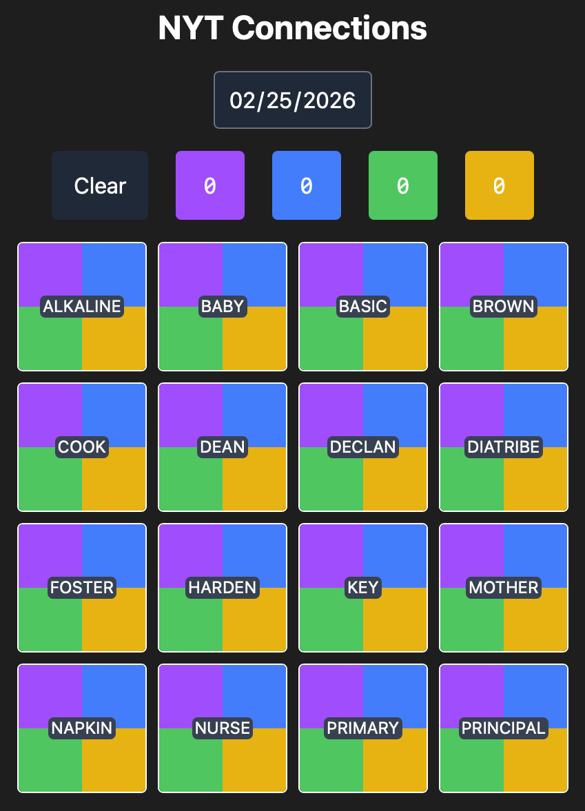

# New York Times Connections Interface

A simple interface for the NYT game [Connections](https://www.nytimes.com/games/connections). It loads Connections words by date and allows you to organize them by color so that you can try to get a reverse rainbow (purple, blue, green, yellow) when you submit them in the real thing.

